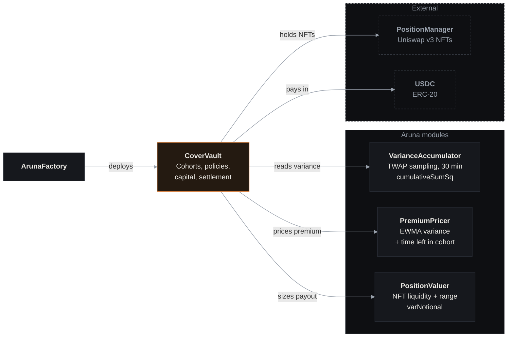

# Smart Contract Architecture

Aruna is composed of five contracts per market. Each market covers one Uniswap v3 pool.

---

## Contract Map

---

## Contracts at a Glance

| Contract                                                        | Role                                                                                                                 |
| --------------------------------------------------------------- | -------------------------------------------------------------------------------------------------------------------- |
| [**CoverVault**](/docs/contracts/cover-vault)                   | Core contract. Manages deposits, cover purchases, variance finalization, and settlement for one (pool, tenor) market |
| [**VarianceAccumulator**](/docs/contracts/variance-accumulator) | Reads Uniswap v3 TWAP at fixed intervals, accumulates `cumulativeSumSq`, tracks gaps                                 |
| [**PremiumPricer**](/docs/contracts/premium-pricer)             | Computes fair premium from EWMA variance, position `varNotional`, strike, and time-to-end                            |
| **PositionValuer**                                              | Reads the LP position NFT and derives `varNotional` - the payout sensitivity to variance                             |
| [**ArunaFactory**](/docs/contracts/factory)                     | Deploys new `(CoverVault, VarianceAccumulator, PremiumPricer, PositionValuer)` tuples for any Uniswap v3 pool        |

---

## One Accumulator, Per-Tenor Vaults

The `VarianceAccumulator` is **shared across all tenors** for the same pool. It is a pure data store - it measures price variance without knowing anything about policies or cohorts.

Each vault (`CoverVault`) consumes the accumulator's data for its own cohort windows. A pool with both 7-day and 14-day tenors has two vaults but only one accumulator.

---

## Permissionless Factory

`ArunaFactory` is fully permissionless. Anyone can call `deploy(pool, ...)` to create a vault for any Uniswap v3 pool. There is no admin gate or allowlist at the contract level.

**Curation happens off-chain.** The frontend's indexer filters vaults by the `isTest` flag and by whether they appear in the known-good deployment manifest. Unlisted vaults are valid contracts but are not surfaced to users. This design prevents front-running the "official market" status on-chain while keeping the contract itself open.

---

## ABI Stability

The v2 ABI is frozen. The `ReleaseGuard` in the factory verifies the deployed bytecode's init-code hash at deploy time. This means:

- The release deployment must match the exact v2 bytecode
- Only addresses change between deployments - never the ABI
- Clients (frontend, bots) pin to the v2 ABI and only update the addresses when a new deployment occurs

---

## Deployed Addresses

See [Deployed Addresses →](/docs/contracts/addresses) for the current testnet deployment.
