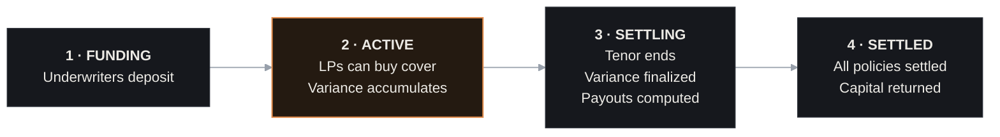

# Cohorts & Cycles

Aruna runs in fixed cycles called **cohorts**. Every vault operates one cohort at a time, and all policies in that cohort settle simultaneously at the end of the tenor.

---

## What Is a Cohort?

A cohort is a fixed-duration insurance cycle tied to one vault (one pool). It has:

- A **start time** and **end time** determined by a calendar anchored at vault creation
- A **tenor** - the duration of protection (7, 14, or 28 days in production; 3600s in the current sandbox)
- A **settlement gap** - a short window after the tenor ends where finalization and payouts are processed
- A fixed pool of **underwriter capital** committed before the cycle starts

LPs can join any day during the cohort and are charged a pro-rata premium for the **remaining time** until the cohort ends. Everyone - regardless of when they joined - settles simultaneously at the same end time.

---

## Cohort Lifecycle



### FUNDING

The cohort has been scheduled but the tenor has not started yet. Underwriters can deposit during this window. LPs cannot yet buy cover.

The vault's `deposit(cohortId, amount)` function is callable. The cohort's `totalCapital` grows as underwriters commit USDC.

### ACTIVE

The tenor is running. The TWAP accumulator is being sampled every 30 minutes by keeper bots (or anyone who calls `keeperPoke`). LPs can call `quote()` and then `buyCover()` to purchase cover.

Every `buyCover` reserves `maxPayout` from the vault's free capacity. Cover cannot be sold if `reserved + maxPayout > totalCapital × maxUtilizationBps / 10000`.

### SETTLING

The tenor has ended. The keeper calls `finalize(cohortId)` to snapshot the final `cumulativeSumSq` at the cohort's end index, then calls `settleBatch(cohortId, n)` repeatedly until all policies are processed.

LPs with variance above their strike receive their payout automatically (or it is parked for later claim if the transfer fails).

### SETTLED

All policies are settled, payouts distributed, NFT positions returned to owners, and remaining capital (plus unclaimed premiums from cancelled policies) is available for underwriters to `withdraw()` or `rollTo()`.

---

## The Calendar

Cohort start times are not driven by settlement completion - they follow a **pure time-based calendar** anchored at vault creation:

```
cohortStart(n) = anchor + (n − 1) × (tenor + gap)
```

Where `anchor` is the timestamp baked into the vault at deployment, `tenor` is the protection duration, and `gap` is the settlement window.

This means:

- Every cohort's start time is known in advance and predictable
- The calendar never waits for settlement to finish
- If settlement of cohort `n` runs late (past the gap), cohort `n+1` starts on schedule regardless

**During the gap between cohorts, LP positions are not covered.** The cohort-n policies ended at `endsAt`; cohort `n+1` policies haven't started. This gap is a deliberate property of the "honest tenor" design: if you pay for 7 days of cover, you receive exactly 7 days of cover.

---

## Capacity Model

Each cohort tracks three capital figures:

| Field          | Meaning                                                    |
| -------------- | ---------------------------------------------------------- |
| `totalCapital` | Sum of all underwriter deposits for this cohort            |
| `reserved`     | Sum of `maxPayout` for all active (unsettled) policies     |
| `free`         | `totalCapital − reserved` (available to back new policies) |

When an LP calls `buyCover`, the contract checks:

```
reserved + maxPayout ≤ totalCapital × maxUtilizationBps / 10_000
```

`maxUtilizationBps` is a vault parameter (e.g., 8000 = 80%). It ensures a buffer of uncommitted capital always exists. If the check fails, the transaction reverts with `CapacityExceeded`.

**Capital is locked for the entire cohort.** Underwriters cannot withdraw between `deposit()` and the cohort's final `SETTLED` state. This is what makes payouts fully collateralized - the capital is already there before any cover is sold.

---

## Policy Cap

Each vault has a `policyCap` - a maximum number of policies per cohort. This bounds the worst-case settlement gas cost to a finite number of `settleBatch` calls.

Additionally, each policy has a minimum `maxPayout` threshold: `totalCapital / policyCap`. This prevents "dust" policies that would lock capacity while contributing negligible payout, making the limit exploitable.

---

## Missed Samples & Degraded Mode

If the keeper misses a sample window, the `VarianceAccumulator` records a gap. When the number of gaps causes a policy's measurement window to fall below the minimum viable data threshold (fewer than ~5 samples), that policy is considered **unmeasurable**: payout is zero and the **premium is refunded in full**.

If some samples are present but gaps exist, the cohort is marked **degraded** - the measurement proceeds with the available samples (which biases toward underwriters since variance is underestimated), and both sides see the degraded flag in the settlement UI. No refund is issued for degraded policies.

---

## Roll vs Withdraw

At settlement, underwriters have two choices:

- **Withdraw** (`withdraw(cohortId)`): receive `capital + premiums − claims` in USDC immediately
- **Roll** (`rollTo(fromCohort, toCohort)`): move the net settlement amount directly into the next cohort's deposit, without first withdrawing and re-depositing

Rolling is only available while the target cohort is still in FUNDING. If settlement finishes after the next cohort has already started, underwriters must roll to `n+2` or withdraw.

Capital is never rolled automatically. Rolling is always an explicit on-chain choice.
